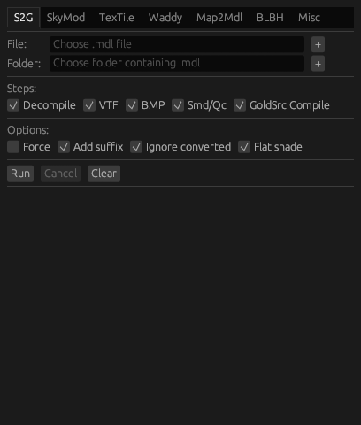

# gchimp

一个包含图形界面和命令行界面的GoldSrc地图工具集合

**您可以在这里访问gchimp-web(原生应用程序的迷你版本):[http://gchimp.romanian-jumpers.com/](http://gchimp.romanian-jumpers.com/)**



## 安装

前往[发布页面](https://github.com/khanghugo/gchimp/releases)下载应用程序或最新的[Actions](https://github.com/khanghugo/gchimp/actions)提交。

通常情况下它可以直接使用。如果遇到任何问题，请尝试通过终端启动程序，您将看到程序输出以便更好地诊断问题。

## 功能

- [S2G: Source引擎到GoldSrc引擎的模型转换器](https://github.com/khanghugo/gchimp/wiki/S2G)

- [SkyMod: 使用图片创建天空盒模型](https://github.com/khanghugo/gchimp/wiki/SkyMod)

- [TexTile: 平铺纹理及更多功能](https://github.com/khanghugo/gchimp/wiki/TexTile)

- [Waddy: 简单的WAD编辑器](https://github.com/khanghugo/gchimp/wiki/Waddy)

- [Map2Mdl: 轻松将.map转换为.mdl](https://github.com/khanghugo/gchimp/wiki/Map2Mdl)

- [命令行界面: 一些不需要图形界面处理的功能(或者更适合命令行处理)](https://github.com/khanghugo/gchimp/wiki/Command%E2%80%90line-interface)

- [其他功能如.wav循环器、.smd分割器等](https://github.com/khanghugo/gchimp/wiki/Misc)

- [自定义脚本: 编写您自己的功能](https://github.com/khanghugo/gchimp/wiki/Custom-Scripting)

### 计划功能

- [ ] 辐射度编译器。这需要一段时间。

## 构建

要构建原生 egui 应用程序，请执行

```sh
cargo build --package gchimp-native
```

要运行本机 egui 应用程序，请执行

```sh
cargo run --release --package gchimp-native
```